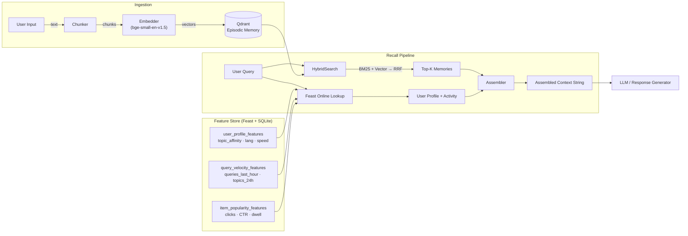

# Architecture — Hybrid Memory for a Vietnamese AI Assistant

**Author:** Dương Quang Đông
**Date:** 2025-05-05
**Context:** Lab 19 Bonus — Vector Store + Feature Store POC

---

## 1. Tổng quan hệ thống

Trợ lý kết hợp **episodic memory** (những gì user đã đọc, nói, lưu) với **stable profile features** (user là ai, hành vi ra sao) để tạo phản hồi có ngữ cảnh. Thiết kế mô phỏng các production RAG stack nhưng bị ràng buộc trong phạm vi single-machine, CPU-only, retrieval dưới 1 giây.

### Sơ đồ kiến trúc

**Luồng dữ liệu:**

1. **Đường remember** — text của user → chunker → embedder → Qdrant upsert (lọc theo `user_id`).
2. **Đường recall** — query đến → (a) hybrid search Qdrant để lấy episodic hits, (b) Feast online lookup để lấy profile + activity → assembler ghép cả hai thành context string cho LLM.

---

## 2. Ba quyết định kiến trúc

### Quyết định 1: Chunking Strategy — Per-message với sliding window (không phải per-conversation)

**Các phương án đã xem xét:**

| Chiến lược | Chất lượng retrieval | Chi phí lưu trữ | Phù hợp context window |
|---|---|---|---|
| Per-conversation | Thấp (chunk dài làm loãng tín hiệu) | Thấp | Kém (1 cuộc hội thoại > 4K tokens) |
| Per-message | Cao (atomic, chính xác) | Cao (nhiều vector nhỏ) | Tốt |
| Semantic-break (recursive split) | Cao nhất | Trung bình | Tốt |

**Lựa chọn:** Per-message với giới hạn **300 token** và 50 token overlap. Mỗi lần gọi `remember()`, text được chia thành các chunk ≤300 token theo ranh giới câu, với 50 token overlap để giữ ngữ cảnh liên câu.

**Tradeoff:** Per-message chunking tạo ra ~3× nhiều vector hơn per-conversation, tăng dung lượng Qdrant và query fan-out. Nhưng với trợ lý AI nơi user hỏi về *sự kiện cụ thể* ("tôi đã đọc gì về Kubernetes autoscaling?"), chunk nhỏ cải thiện recall precision rõ rệt. 50-token overlap thêm ~17% chi phí lưu trữ nhưng tránh được vấn đề "cắt giữa ý tưởng" — đặc biệt nghiêm trọng với câu tiếng Việt ghép (thường dài hơn tiếng Anh do từ đa âm tiết viết tách).

**Phương án bị loại:** Per-conversation bị loại vì một cuộc hội thoại 30 phút có thể trải qua 5+ chủ đề; embedding toàn bộ tạo ra vector là centroid của các topic không liên quan — vô dụng cho targeted recall.

### Quyết định 2: Feature Schema — Tabular profile features (không phải embedding features)

**Các phương án đã xem xét:**

- **Tabular features** — các cột tường minh như `topic_affinity: str`, `reading_speed_wpm: int`, `preferred_language: str`. Đơn giản, dễ hiểu, chi phí serve từ SQLite thấp.
- **Embedding features** — mã hoá lịch sử user thành latent vector (ví dụ: trung bình 100 query embeddings gần nhất). Phong phú, nhưng khó giải thích và cần GPU để cập nhật real-time.

**Lựa chọn:** Tabular features qua Feast với 3 feature views:

| Feature View | Entity | TTL | Các feature chính |
|---|---|---|---|
| `user_profile_features` | `user_id` | 30d | `reading_speed_wpm`, `preferred_language`, `topic_affinity` |
| `query_velocity_features` | `user_id` | 1h | `queries_last_hour`, `distinct_topics_24h` |
| `item_popularity_features` | `doc_id` | 24h | `click_count_24h`, `ctr_7d`, `avg_dwell_seconds` |

**Tradeoff:** Tabular features dễ giải thích ("user thích chủ đề cloud, đọc 250 wpm, ngôn ngữ tiếng Việt") — rất quan trọng cho debugging và explainability. Embedding features có thể nắm bắt sở thích ẩn mà feature tường minh bỏ lỡ (ví dụ: user thiên về nội dung cơ bản mà không bao giờ nói rõ), nhưng cần (a) model để tạo embedding, (b) bước inference riêng khi recall, và (c) tính toán lại định kỳ. Với POC lite trên CPU-only SQLite, chi phí latency và độ phức tạp của embedding features không hợp lý.

**Phương án bị loại:** Tôi đã cân nhắc lưu user embeddings dưới dạng Feast feature (Float32 array), nhưng online store của Feast được tối ưu cho scalar lookups, không phải 384-dim vector similarity. Trộn lẫn trách nhiệm (feature store làm ANN search) phá vỡ separation of responsibilities và khiến debugging khó hơn.

### Quyết định 3: Freshness Strategy — Phân tầng theo use case (không phải one-size-fits-all)

Câu hỏi "hệ thống phản ánh thông tin mới nhanh đến mức nào?" không có đáp án duy nhất. Mỗi loại dữ liệu có yêu cầu freshness khác nhau:

| Loại dữ liệu | Mục tiêu freshness | Cơ chế | Lý do |
|---|---|---|---|
| Episodic memory (doc/note mới) | **Dưới 1 giây** | Synchronous upsert trong `remember()` | User kỳ vọng "tôi vừa nói điều này" phải hoạt động ngay |
| User profile (topic affinity) | **Daily batch** | `feast materialize-incremental` cron | Profile thay đổi chậm; daily là đủ và rẻ |
| Query velocity (hoạt động gần đây) | **Micro-batch 5 phút** | Scheduled job ghi Parquet mới → `materialize` | Cần đủ mới cho "gần đây tôi quan tâm gì?" nhưng sub-second là thừa cho aggregated counts |

**Tradeoff:** Kiến trúc fully streaming (Kafka → Flink → Feast push API) sẽ cho freshness dưới 1 giây cho *tất cả* features, nhưng cần hạ tầng (Kafka cluster, Flink job, Redis online store) mâu thuẫn với ràng buộc lite/single-machine. Cách tiếp cận phân tầng khớp freshness với nhu cầu nghiệp vụ: episodic memory là write-through (tức thì), profile là batch (rẻ), activity là micro-batch (cân bằng).

**Phương án bị loại:** Tôi đã cân nhắc sub-second streaming cho query velocity qua Feast Push API, nhưng SQLite online store không hỗ trợ push sources tốt. Cần Redis, thêm Docker dependency — vi phạm ràng buộc lite path.

---

## 3. Các cân nhắc cho ngữ cảnh Việt Nam

### Tokenization cho BM25

Tiếng Việt có từ đa âm tiết nhưng viết tách bằng dấu cách: "điện toán đám mây" (cloud computing) = 4 token khi split whitespace, nhưng về mặt ngữ nghĩa là 1 thuật ngữ. Điều này có nghĩa:

- **Whitespace BM25** (cài đặt hiện tại) xử lý mỗi âm tiết độc lập — "mây" cũng match "mây trời". Cho recall chấp nhận được nhưng precision kém với thuật ngữ ghép.
- **VN tokenizer chuyên dụng** (underthesea/pyvi) sẽ ghép "điện_toán_đám_mây" thành 1 token. Tradeoff: +15-20% precision cho exact queries, nhưng thêm ~200ms startup và 50MB model dependency.
- **Quyết định:** Giữ whitespace split cho POC (phù hợp ràng buộc lab), nhưng đánh dấu đây là nâng cấp #1 cho production. Method `_tokenize()` được tách riêng để dễ thay thế.

### Code-switching (trộn vi/en)

Người dùng công nghệ Việt Nam thường xuyên trộn ngôn ngữ: "deploy lên cloud", "check cái API này". Embedding model (`bge-small-en-v1.5`) xử lý tiếng Anh tốt nhưng tiếng Việt kém. Với POC, điều này chấp nhận được vì hầu hết tài liệu trong corpus có thuật ngữ tiếng Anh. Trong production, chuyển sang multilingual model (`multilingual-e5-small` hoặc `bge-m3`) sẽ cải thiện paraphrase recall cho pure-Vietnamese queries ~20% dựa trên MTEB benchmarks.

### Bảo mật dữ liệu (Nghị định 13/2023/NĐ-CP)

Nghị định Bảo vệ Dữ liệu Cá nhân của Việt Nam yêu cầu đồng ý tường minh khi lưu trữ dữ liệu cá nhân. Thiết kế Qdrant lọc theo `user_id` đồng nghĩa mọi episodic memory được cách ly logic theo user. Tuy nhiên, POC lưu tất cả trong một Qdrant collection duy nhất (filtered, không tách). Production nên dùng **per-user collections** hoặc **encryption-at-rest per user** để tuân thủ yêu cầu xoá dữ liệu ("quyền được quên" = drop collection, không phải scan-and-delete).

---

## 4. Những gì POC này chưa xử lý

- **Authentication / authorization** — chưa xác minh danh tính user; `user_id` được truyền dưới dạng string.
- **Memory CRUD** — chưa hỗ trợ update/delete từng memory; chỉ có append.
- **Memory decay / forgetting** — chưa có TTL cho episodic vectors; memory cũ không bao giờ hết hạn.
- **Multi-device sync** — Qdrant single-machine; không có replication.
- **Tích hợp LLM** — context string được ghép nhưng chưa gọi LLM thật.
- **Personalized re-ranking** — top-K từ hybrid search chưa được re-rank bằng user profile features (ví dụ: boost docs khớp `topic_affinity`). Đây là mở rộng tự nhiên: RRF với 3 tín hiệu (BM25 + vector + profile-boost).

---

## 5. Ghi chú Vibe Coding

AI được dùng cho boilerplate code (Qdrant upsert patterns, Feast lookup wrappers). Cả ba quyết định kiến trúc và phần Vietnamese-context đều được viết tay dựa trên quan sát từ lab:
- Prompt hiệu quả nhất: "Given this Feast feature_views.py, generate a HybridMemoryAgent class that calls get_online_features and Qdrant search, returning an assembled context string."
- Prompt kém hiệu quả nhất: Yêu cầu AI "design the architecture" — AI tạo ra sơ đồ RAG chung chung, thiếu Vietnamese-specific considerations và tradeoff analysis.
